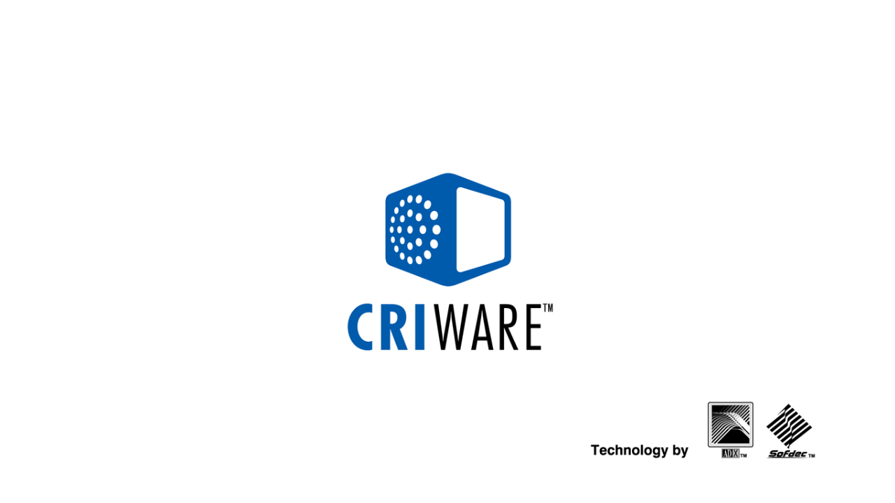

# Virtua Fighter 5 — Static Recompilation

> Turning Sega AM2's *Virtua Fighter 5* (2007, `BLUS30020`) from a PS3 disc
> binary into a native Windows executable — no emulator underneath.

*Virtua Fighter 5* is Yu Suzuki's series at its most austere: no items, no
gimmicks, seventeen fighters and a frame-perfect combat engine that AM2 built on
the Lindbergh arcade board and brought to PS3 in early 2007. It is also an unusually clean
recompilation target — see below.

This project takes the disc's own `EBOOT.BIN`, disassembles every PowerPC
function, lifts them to C++, and links the result against
[ps3recomp](https://github.com/sp00nznet/ps3recomp) — clean-room HLE runtime
libraries that stand in for the PS3 operating system. Same approach as
[twistedmetal](https://github.com/sp00nznet/twistedmetal),
[flow](https://github.com/sp00nznet/flow) and
[simpsonsarcade-ps3](https://github.com/sp00nznet/simpsonsarcade-ps3).

**You supply your own disc.** No game binary, asset, or key is committed here.

## Why this title

Static recompilation cost is set by a title's *operating-system surface* — the
`proc_prx_param` → libstub import table — far more than by genre, binary size or
how the game looks. VF5's is unusually small:

| | |
|---|---|
| Imported functions | **107** |
| Imported modules | **10** |
| PSN / online imports | **0** |
| `cellSpurs` imports | **0** |
| exec segment | 6.3 MB |

The whole list, and every one of the ten already implemented in ps3recomp:

```
cellSysutil(23)  sysPrxForUser(22)  cellGcmSys(19)  cellAudio(11)
cellResc(11)     sys_fs(8)          cellSync(5)     sys_io(4)
cellRtc(3)       cellSysmodule(1)
```

That is the entire OS dependency. **No `sceNp`, no `sys_net`, no `cellNetCtl`**
— nothing to gate the boot on a PSN handshake. **No `cellSpurs`** — the SPURS
jobchain/task pipeline that has been the long pole on other ports is simply not
in this binary; VF5 drives its four SPU programs through raw
`sys_spu_thread_group_*` plus five `cellSync` primitives, the path ps3recomp
implements most directly.

The bet: with the live NV4097 → D3D12 engine executing titles' real vertex and
fragment programs, a title whose only real dependencies are GCM, audio, pad and
the filesystem should reach geometry with the least new runtime work — and it is
a genuine 3D game, so what it draws is a real test of the engine rather than a
UI composite.

It held. `vf5.exe` linked on the first attempt with **nothing title-specific in
the tree**: no `hle_extra.cpp`, no forked `boot_main`, no patched functions.

## Status

| Phase | State |
|---|---|
| Disc inventory | **done** — `BLUS30020`, disc game, no game-side PRX |
| `EBOOT.BIN` → plain `EBOOT.ELF` | **done** — `../twistedmetal/tools/decrypt_self.py`, 8.1 MB ELF |
| Import / NID analysis | **done** — 107 imports, 10 libraries, 99 named (92%) |
| Function boundary detection | **done** — 17,856 functions, `.opd` + prologue/leaf/extent |
| SPU image extraction | **done** — 4 embedded SPU ELFs, 344 KB |
| SPU lifting | **done** — all 4 lifted (4,121 functions), registered by fingerprint |
| PPU lifting | **done** — 18,514 functions emitted, 7,855 unique call targets, 105 MB of C++ |
| HLE NID table | **done** — 1,040 handlers across 88 modules |
| Build & link | **done** — 89 MB x86-64 exe, clang-cl 21 + Ninja, 0 errors, no title-specific code |
| Boot | **renders** — 0 dropped draw groups, zero failed file opens, zero unresolved imports |
| Game data install | **done** — the title's own check runs to "Check complete."; needs the one-time setup in *Building* |
| On screen | **NOW LOADING, "Presented by SEGA", CRIWARE, "Created by AM2"** — its own boot sequence, read back from the swapchain |
| Past the logos | **not reached** — renders four boot logos, then renders without presenting |
| Attract mode | **not reached** — needs CRI Sofdec video decode |

### The binary

```
EBOOT.elf     8,109,128 bytes   ELF64 big-endian PowerPC64, ET_EXEC
                                entry 0x690E58 -> OPD { func 0x1022C, toc 0x6BB088 }
                                8 program headers, 38 sections
  PT_LOAD[0]  0x00010000  R-X  0x648958   code + rodata
  PT_LOAD[1]  0x00660000  RW-  0x0614C4   data
  PT_LOAD[2]  0x10000000  R--  0x070CD8
  PT_LOAD[3]  0x10080000  RW-  0x06EE00   (+ 6.2 MB .bss)
```

Retail, so it is stripped. Function recovery leans on the `.opd` table plus
ps3recomp's prologue/leaf/extent heuristics.

**`--code-end 0x5CC830`.** The last `SHF_EXECINSTR` section ends there, and it
is also the section that holds the `.lib.stub` import trampolines
(`0x5CBAD0..0x5CC810`) — so the bound has to sit just past them, not before, or
`--hle-stubs` has nothing to rewrite. Everything above `0x5CC830` is `.rodata`
packed into the same R-X segment, which is exactly the data-as-code trap that
cost flOw and YDKJ multi-gigabyte lifts.

## What is on screen




Both read back from the D3D12 swapchain with `LD_FRAME_DUMP` — the title's own
**NOW LOADING** screen in its own font, from the sprite and font archives it
loads, then the **CRIWARE** boot logo, animating across consecutive frames.

## Where it stops

It renders its own boot sequence -- **NOW LOADING**, **"Presented by SEGA"**,
the **CRIWARE** logo with its ADX/Sofdec sub-marks, and **"Created by AM2, AM
R&D DEPT. #2"** -- all read back from the D3D12 swapchain with `LD_FRAME_DUMP`,
so they are what the port actually drew. Then it stops, without ever reaching a
title screen.

*(The analysis that used to be here located the stop at a render gate cleared at
guest flip 782 and concluded attract mode needed CRI Sofdec. It was measured
while the title was failing 339 file opens a run and had already been told its
game data was corrupt, so it was not describing the boot a correct run takes.
Sofdec is still absent and still needed for the attract movie; it is no longer
established that Sofdec is what this stop is.)*

### The stop, precisely

The title renders continuously and never presents. Over five minutes:

```
21,701  render-target / viewport changes
   636  cellGcmSetDefaultCommandBuffer          <- it keeps resetting its ring
   976  cellGcmAddressToOffset FAILED
    20  draws
     0  flips after frame ~3,650
```

It is not deadlocked -- it burns ~1.2 cores the whole time.

**The 976 failures are the thread to pull, and they are all the same shape:**
every failing address sits immediately past the memory the title mapped.

```
Init(cmdSize=0x6FF000, ioSize=0x700000, ioAddr=0x4A900000)   0x4A900000..0x4B000000
MapMainMemory(ea=0x4B000000, size=0x400000)                  0x4B000000..0x4B400000
AddressToOffset failed for 0x4B400040, 0x4B400070, 0x4B400080, ...
```

The obvious suspicion was a second mapping being refused quietly, since every
validation branch in `cellGcmMapMainMemory` used to return *before* its only log
line. That is fixed upstream (each refusal now names itself), and it settles the
question the other way: there is **one** MapMainMemory call in a whole boot and
it succeeds. So the title is using main memory it never asked us to map, and
without offsets for it there is nothing to draw with -- hence 20 draws, hence
the ring resets, hence no flip.

**Where that leaves the render gate.** Holding the one-byte gate at `0x104D320A`
(`PPU_FORCE_READ_ADDR=104D320A PPU_FORCE_READ_VAL=1`) does make the title flip
freely -- 23,040 frames against 3,648 and a stall -- but with **zero** command
packets reaching the engine and every frame black. It skips the state in which
the title renders rather than unblocking it, which is worth knowing and is not a
fix.

The live NV4097 engine drops nothing throughout (`exec` equals `seen`, all
`drop` counters zero), so the missing work is on the title's side of the FIFO.

## Building

Prereqs: a built `ps3recomp` (`../ps3recomp/build/ps3recomp_runtime.lib`),
clang-cl, Ninja, Python 3.9+.

```bash
# 1. your own disc -> game/EBOOT.elf
python ../twistedmetal/tools/decrypt_self.py \
    vfs/PS3_GAME/USRDIR/EBOOT.BIN -o game/EBOOT.elf --keys <your scetool keys>

# 2. lift: PPU tree, HLE NID table, 4 SPU images + their fingerprint registry
./tools/relift.sh

# 3. build
cmake -S . -B build -G Ninja \
    -DCMAKE_C_COMPILER=clang-cl -DCMAKE_CXX_COMPILER=clang-cl
cmake --build build

# 4. run, through the live NV4097 -> D3D12 engine
PS3_VFS_ROOT=vfs PS3_HDD0_ROOT=$PWD/gamedata/dev_hdd0 \
    RSX_LIVE_DRAW=1 ./build/vf5 game/EBOOT.elf
```

Two things in that line are easy to get wrong, and both look like a port bug
rather than a setup mistake.

**`PS3_VFS_ROOT` is `vfs`, not `vfs/PS3_GAME/USRDIR`.** The title asks for its
files by full guest path (`/dev_bdvd/PS3_GAME/USRDIR/rom/sound/snd_db.txt`) and
the VFS joins that under the root, so pointing the root at the USRDIR doubles
the path:

```
[fs] open FAIL '/dev_bdvd/PS3_GAME/USRDIR/rom/sound/snd_db.txt'
  -> 'vfs/PS3_GAME/USRDIR/PS3_GAME/USRDIR/rom/sound/snd_db.txt'
```

339 failed opens per run. This README documented the wrong root until now,
which is worth saying plainly: the earlier "134 files loaded" figure was
measured with most of the disc unreachable.

**Virtua Fighter 5 needs its game data installed, or it refuses to start.** On
a real PS3 the title copies its streamed audio and movies to the HDD on first
run, then checks that install. With nothing there it puts up its own dialog and
stops:

```
[DIALOG] Do you want to use game data? ...
[DIALOG] Game data is corrupt. To use game data...please exit the game and
         delete this game data.
```

That is the title behaving correctly on a machine where the install never
happened, not a recompilation failure. Emulate the install once:

```powershell
New-Item -ItemType Directory -Force gamedata\dev_hdd0\game\BLUS30020
Copy-Item vfs\PS3_GAME\PARAM.SFO gamedata\dev_hdd0\game\BLUS30020\
Copy-Item vfs\PS3_GAME\ICON0.PNG gamedata\dev_hdd0\game\BLUS30020\
New-Item -ItemType Junction -Path gamedata\dev_hdd0\game\BLUS30020\USRDIR `
         -Target (Resolve-Path vfs\PS3_GAME\USRDIR)
```

A junction rather than a copy: the installed USRDIR *is* the disc's USRDIR, so
there is no reason to spend the disk space. With that in place the title runs
its real check through to `[DIALOG] Check complete.`, opens every file it asks
for -- **zero** failed opens -- and boots on through its logo sequence.

`RSX_LIVE_DRAW=1` selects caner's ([@canersaka](https://github.com/canersaka))
live draw engine, wired into ps3recomp's *generic* boot harness rather than
forked per title; unset it and the older `rsx_d3d12_backend` path runs instead.

## Layout

```
game/            your decrypted EBOOT.elf                       (git-ignored)
vfs/             your disc contents, PS3_VFS_ROOT points inside (git-ignored)
imports.json     the 107 imports, named — checked in, it is analysis not content
config.toml      module disposition (all ten are "hle")
analysis/        find_functions + extracted SPU ELFs            (git-ignored)
src/compat/      <dirent.h>/<unistd.h> Windows shims for clang-cl
src/recomp/      lifted PPU tree                                (git-ignored)
src/gen/         generated HLE NID table                        (git-ignored)
src/spu_gen/     lifted SPU images                              (git-ignored)
tools/           relift.sh regenerates every one of the above, plus
                 merge_split_loops.py and a screenshot helper
docs/            the working log, the diagnostics list, and two frame captures
```

Nothing derived from the game binary is committed. `tools/relift.sh`
regenerates all of it from your own dump.

## Credits & legal

MIT licensed — see [LICENSE](LICENSE).

Built on [ps3recomp](https://github.com/sp00nznet/ps3recomp) and its
contributors' work — in particular [@canersaka](https://github.com/canersaka)'s
live NV4097 draw engine and [@sagemono](https://github.com/sagemono)'s RSX
backend. *Virtua Fighter 5* is © Sega / AM2. This repository contains no game
code, assets, or decryption keys, and is useless without your own legally
obtained copy.
